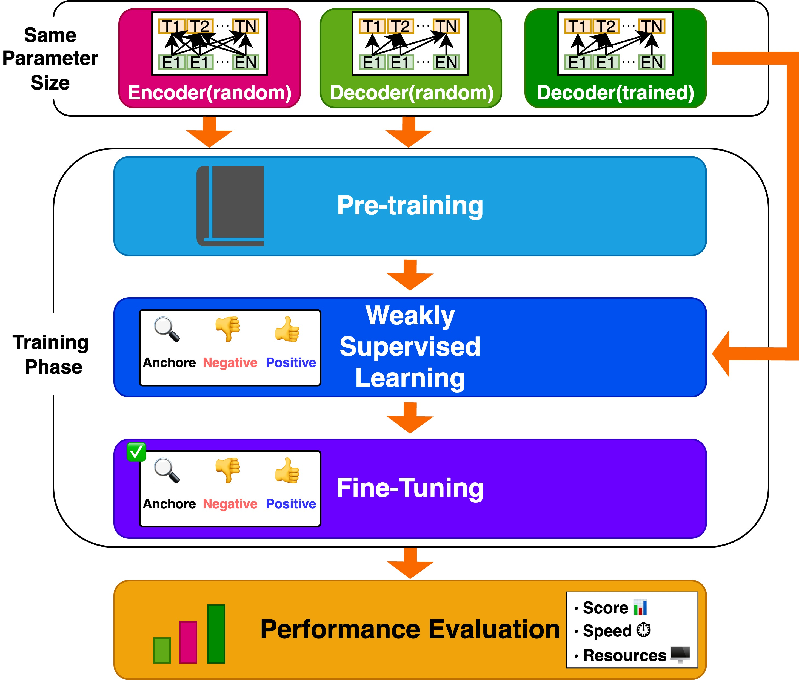

# **MIREI**: **M**atched **I**nvestigation of **R**epresentation **E**mbedding **I**nsights

English / [日本語](README_JA.md)

MIREI is a research workspace that builds encoder/decoder text-embedding models under matched conditions, tracks shared training pipelines, and benchmarks their performance differences.



## Resources

- Paper: [ANLP 2026 Proceedings (C9-1)](https://www.anlp.jp/proceedings/annual_meeting/2026/pdf_dir/C9-1.pdf)
- Hugging Face Collection: [MIREI Collection](https://huggingface.co/collections/iamtatsuki05/mirei)

## How to operate uv
### setup
1. Install with`git clone https://github.com/iamtatsuki05/MIREI.git`
### uv configuration
1. `uv sync`
2. `uv sync --group cuda`
### run script
```shell
uv run python ...
```

## How to operate docker
### setup
1. Install with`git clone git clone https://github.com/iamtatsuki05/MIREI.git`
### docker configuration
1. `docker compose up -d --build <service name(ex:python-cpu)`
### Connect to and disconnect from docker
1. connect`docker compose exec <service name(ex:python-cpu)> bash`
2. disconect`exit`
### Using jupyterlab
1. Access with a browser http://localhost:8888/lab
### Starting and Stopping Containers
1. Starting`docker compose start`
2. Stopping`docker compose stop`

## Directory structure
```text
./
├── .dockerignore
├── .git
├── .gitattributes
├── .github
├── .gitignore
├── .pre-commit-config.yaml
├── README.md
├── README_JA.md
├── compose.yaml
├── config
├── data
│   ├── datasets
│   ├── misc
│   ├── models
│   ├── outputs
│   └── raw
├── docker
│   ├── cpu
│   └── gpu
├── docs
├── notebooks
├── uv.lock
├── pyproject.toml
├── scripts
│   ├── README.md
│   ├── README_JA.md
│   └── constract_llm
│       ├── README.md
│       ├── README_JA.md
│       ├── dataset
│       ├── model
│       ├── tokenizer
│       └── train
│           ├── README.md
│           ├── README_JA.md
│           ├── ft
│           └── pt
├── src
│   ├── __init__.py
│   └── mirei
│       ├── common
│       ├── config
│       ├── env.py
│       └── constract_llm
└── tests
    └── mirei
```

## Scripts

This project includes various scripts related to building and training language models (LLMs). For more details, please refer to the following READMEs:

- [Scripts Overview](scripts/README.md) - Overview of basic scripts
- [Language Model Construction Scripts](scripts/constract_llm/README.md) - Scripts related to language model construction
- [Training Scripts](scripts/constract_llm/train/README.md) - Scripts for pre-training and fine-tuning
  - [Pre-training Scripts](scripts/constract_llm/train/pt/README.md) - Scripts for MLM and MNTP pre-training
  - [Fine-tuning Scripts](scripts/constract_llm/train/ft/README.md) - Scripts for Sentence Transformer fine-tuning
